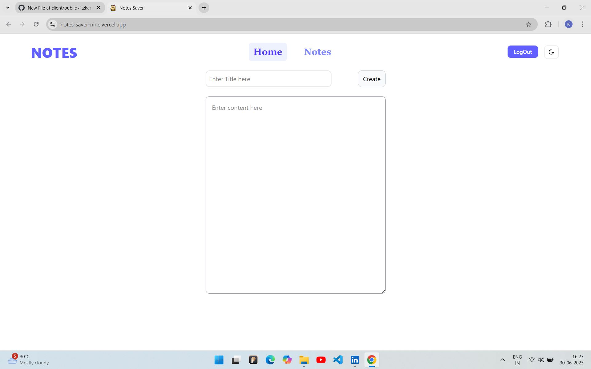
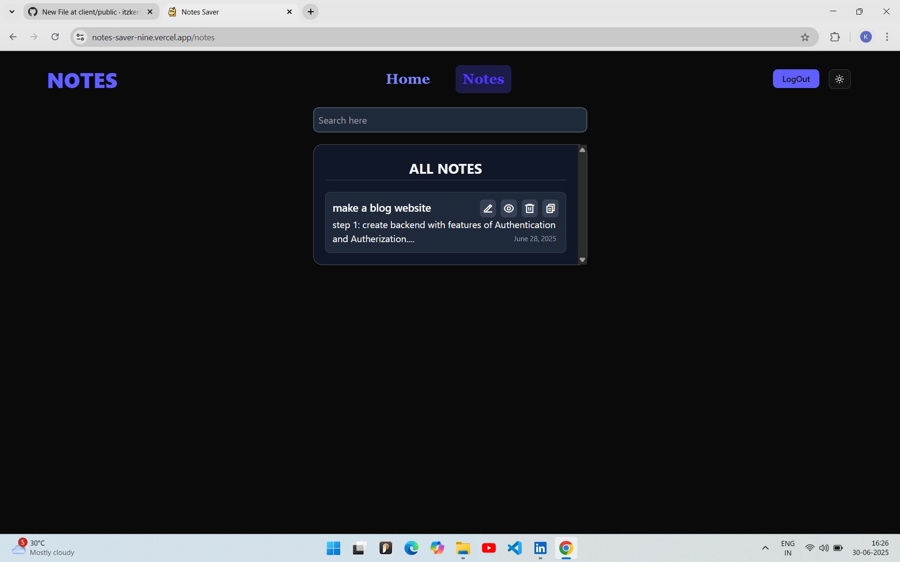

# 📝 Notes Saver

A full-stack note-taking web application built with the **MERN stack** (MongoDB, Express.js, React, Node.js) and **Redux Toolkit**. Notes Saver allows users to create, update, delete, and view notes with a clean and responsive UI. It also supports authentication, dark mode, and live preview.

  <a href="https://notes-saver-nine.vercel.app/" target="_blank">
    🔗 <strong>Live Demo</strong>
  </a>

## 🚀 Features

- 🔐 **Login/Register** with username and password
- ✍️ **Create, Edit & Delete** notes
- 📋 **Copy to clipboard** functionality
- 👁️ **Preview individual notes**
- 🌙 **Dark Mode** support
- 🔍 **Search Notes** by title
- 📦 **Redux Toolkit** for state management
- ⚡ **Vite + React** frontend
- ☁️ **MongoDB Atlas** backend storage

---

## 📸 Screenshots

| Light Mode | Dark Mode |
|------------|-----------|
|  |  |

---

## 🛠 Tech Stack

### Frontend
- React
- Vite
- Redux Toolkit
- Tailwind CSS
- React Hot Toast
- React Router DOM

### Backend
- Node.js
- Express.js
- MongoDB
- Mongoose

---

## 📁 Folder Structure
notes-saver/

├── client/ # React frontend

│ ├── src/

│ │ ├── components/

│ │ ├── features/

│ │ ├── utils/

│ │ └── main.jsx

│ └── public/

│ └── favicon.ico

├── server/ # Node + Express backend

│ ├── controllers/

│ ├── models/

│ ├── routes/

│ └── index.js

└── README.md

# 📝 Notes Saver

